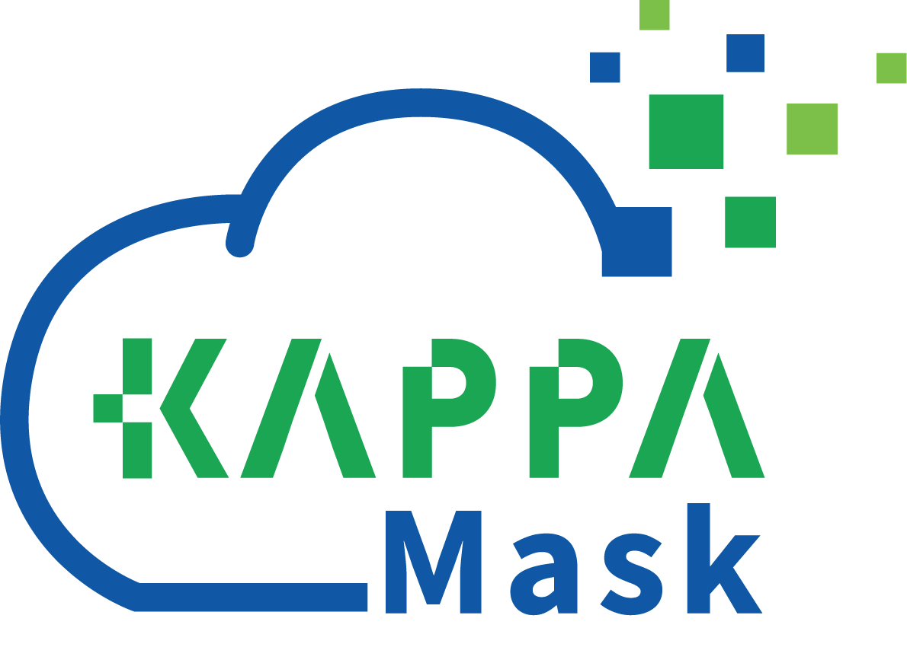

# KappaMask (km_predict) :cloud:
KappaMask, or km-predict, is a cloud detector developed by [KappaZeta LTD](https://kappazeta.ee/) for Sentinel-2 Level-1C and Level-2A input products. 
The project was funded by European Space Agency, Contract No. 4000132124/20/I-DT.

Currently, KappaMask outputs results in TIFF and PNG formats. Each pixel is classified as one of the following classes:
Class | TIFF | PNG | Description |
--- | --- | --- | --- | 
Clear | 1 | 66 | Pixels without clouds or cloud shadows. |
Cloud shadow | 2 | 129 | Pixels with cloud shadows. |
Semi-transparent | 3 | 192 | Pixels with thin clouds through which the land is visible; include cirrus clouds that are on the high cloud level (5-15km). |
Cloud | 4 | 255 | Pixels with cloud; include stratus and cumulus clouds that are on the low cloud level (from 0-0.2km to 2km). |
Missing | 5 | 20 |  Missing or invalid pixels. | 

KappaMask has been trained and validated with the following dataset:
* Tetiana Shtym, Olga Wold, Marharyta Domnich, Kaupo Voormansik, Mariana Rohtsalu, Joosep Truupõld, Nikita Murin, Abdullah Toqeer, Catherine Akinyi Odera, Fariha Harun, Indrek Sünter, Heido Trofimov, Anton Kostiukhin, & Mihkel Järveoja. (2022). KappaSet: Sentinel-2 KappaZeta Cloud and Cloud Shadow Masks (Version 1) [Data set]. Zenodo. https://doi.org/10.5281/zenodo.7100327

Related publications:
* Marharyta Domnich, Indrek Sünter, Heido Trofimov, Olga Wold, Fariha Harun, Anton Kostiukhin, Mihkel Järveoja, Mihkel Veske, Tanel Tamm, Kaupo Voormansik, Aire Olesk, Valentina Boccia, Nicolas Longepe, and Enrico Giuseppe Cadau. 2021. "KappaMask: AI-Based Cloudmask Processor for Sentinel-2" Remote Sensing 13, no. 20: 4100. https://doi.org/10.3390/rs13204100


## Dependencies
The following system dependencies are needed:
* micromamba 0.18 or later (https://github.com/mamba-org/mamba)
* python 3.6 or later
* cm_vsm dependencies

Due to the long environment solve times with Miniconda, we have switched to Micromamba. If you're still using Conda, Miniconda or similar, simply substitute `micromamba` with `conda` in the relevant commands below.

## Setup
1. Create a micromamba environment.

        micromamba create -f environment.yml

2. Copy `config/config_example.json` and adapt it to your needs.
3. In order to run sub-tiling procedure cm_vsm should be installed (https://github.com/kappazeta/cm-vsm).
4. Make sure that your `GDAL_DATA` environment variable has been set, according to your GDAL version instead of the placeholder `YOUR_GDAL_VERSION` below:

        GDAL_DATA=/usr/share/gdal/YOUR_GDAL_VERSION


## Input data
In the root of repository create a ```/data``` folder and copy or symlink the .SAFE product into it.

## Usage
### Running locally
Cloudmask inference can be run as follows:

    micromamba activate km_predict
    python km_predict.py -c config/your_config.json

It is possible to overwrite product_name in config file with command line argument -product

    python km_predict.py -c config/your_config.json -product S2B_MSIL2A_20200401T093029_N0214_R136_T34UFA_20200401T122148

If the prediction for the same product is running multiple times and .CVAT folder is created under ```/data``` folder, it might be convenient to disable sub_tiling procedure for the next run by -t

    python km_predict.py -c config/your_config.json -product S2B_MSIL2A_20200401T093029_N0214_R136_T34UFA_20200401T122148 -t

### Testing locally
KappaMask tests can be run from the root of the working copy of the repository as follows:

    micromamba activate km_predict
    pytest

### Running in Docker on AWS
By default, the KappaMask Docker image runs the `km_s3` entrypoint, which expects a Sentinel-2 product title and output path in an S3 bucket.
The entrypoint performs the following operations:
1. Download the Sentinel-2 product in SAFE format from a Sentinel-Hub requester-pays dataset on AWS.
2. Split the product into sub-tiles with overlap and without compression.
3. Calculate the cloud mask for the product and mosaic the sub-tiles.
4. Tile and compress the resulting mosaic and generate overviews.
5. Upload the mask and sub-tiles to and S3 bucket.

KappaMask can be run as a Docker container as follows:
1. Pull the image

        docker pull kappazeta/kappamask:v2.3

2. Run KappaMask for a specific Sentinel-2 product on AWS (please make sure to replace 
`YOUR-AWS-REGION`, `YOUR-AWS-ACCESS-KEY`, `YOUR-AWS-SECRET-KEY`, `YOUR-S3-BUCKET` with your AWS configuration ,
`YOUR-COPERNICUS_ACCESS_KEY_ID` & `YOUR-COPERNICUS_SECRET_ACCESS_KEY` with your Copernicus S3 credentials, 
`YOUR-COPERNICUS_OAUTH_ACCESS_KEY_ID` & `YOUR-COPERNICUS_OAUTH_SECRET_ACCESS_KEY`with your Copernicus OAuth credentials
 and `YOUR-S2-PRODUCT-NAME` with the name of the product to process)

        docker run -e AWS_REGION=YOUR-AWS-REGION -e AWS_ACCESS_KEY=YOUR-AWS-ACCESS-KEY -e AWS_SECRET_KEY=YOUR-AWS-SECRET-KEY -e COPERNICUS_ACCESS_KEY_ID=YOUR-COPERNICUS_ACCESS_KEY_ID -e COPERNICUS_SECRET_ACCESS_KEY=YOUR-COPERNICUS_SECRET_ACCESS_KEY -e COPERNICUS_OAUTH_ACCESS_KEY_ID=YOUR-COPERNICUS_OAUTH_ACCESS_KEY_ID -e COPERNICUS_OAUTH_SECRET_ACCESS_KEY=YOUR-COPERNICUS_OAUTH_SECRET_ACCESS_KEY kappazeta/kappamask:v2.3 YOUR-S2-PRODUCT-NAME s3://YOUR-S3-BUCKET/


For example:

    docker pull kappazeta/kappamask:v2.0
    docker run -e AWS_REGION=eu-central-1 -e AWS_ACCESS_KEY=A******************F -e AWS_SECRET_KEY=3**************************************I -e COPERNICUS_ACCESS_KEY_ID=R**********************4 -e COPERNICUS_SECRET_ACCESS_KEY=K*************************************Y -e COPERNICUS_OAUTH_ACCESS_KEY_ID=sh-**************************b -e COPERNICUS_OAUTH_SECRET_ACCESS_KEY=e**************************y kappazeta/kappamask:v2.3 S2A_MSIL2A_20200509T094041_N0214_R036_T35VME_20200509T111504 s3://my-kappamask-experiments/output/

### Running in Docker locally
KappaMask Docker image can be run locally with the `km_local` entrypoint.
The entrypoint performs the following operations:
1. Check if the .SAFE directory exists in the `/data` volume, or attempt to decompress a .zip file in the volume otherwise.
2. Split the product into sub-tiles with overlap and without compression.
3. Calculate the cloud mask for the product and mosaic the sub-tiles.
4. Tile and compress the resulting mosaic and generate overviews.

KappaMask can be run as a Docker container as follows:
1. Pull the image

        docker pull kappazeta/kappamask:v2.3

2. Run KappaMask for a specific Sentinel-2 product locally

        docker run -v /YOUR-LOCAL-DATA-DIR/:/data kappazeta/kappamask:v2.3 YOUR-S2-PRODUCT-NAME

For example:

    docker pull kappazeta/kappamask:v2.3
    docker run -v /home/kappazeta/Documents/data/cloudmask_data/:/data kappazeta/kappamask:v2.3 S2A_MSIL2A_20200509T094041_N0214_R036_T35VME_20200509T111504

### Testing in Docker
KappaMask can be tested as a Docker container as follows:
1. Pull the image

        docker pull kappazeta/kappamask:v2.3

2. Run KappaMask tests:

        docker run --entrypoint km_test kappazeta/kappamask:v2.3

## Output
The predictor will generate sub-tiles masks under ```/prediction``` folder and full S2 mask under ```/big_image``` folder

## Troubleshooting
Potential solutions for typical issues encountered during setup or usage.

### Unable to open EPSG support file
Sentinel-2 product splitting fails with the following messages:

    INFO: KMP.P: Extracting geo-coordinates.
    ERROR 4: Unable to open EPSG support file gcs.csv.  Try setting the GDAL_DATA environment variable to point to the directory containing EPSG csv files.
    ERROR 4: Unable to open EPSG support file gcs.csv.  Try setting the GDAL_DATA environment variable to point to the directory containing EPSG csv files.
    INFO: KMP.P: Projection:
    terminate called after throwing an instance of 'INFO: KMP.P: Projecting AOI polygon into pixel coordinates.
    GDALOGRException'
      what():  GDAL OGR error : Failed to import spatial reference from EPSG, Generic failure
    Magick: abort due to signal 6 (SIGABRT) "Abort"...

This indicates that the environment variable `GDAL_DATA` has not been configured correctly. This could be done in a variety of ways and the preferred method depends on your linux distribution. An export call for the variable (for example, `GDAL_DATA=/usr/share/gdal/2.2`) could be added to your `.bashrc`, `.profile`, etc. Alternatively, the variable could be set together with the python call, for example:

    GDAL_DATA=/usr/share/gdal/2.2 python km_predict.py -c config/your_config.json

### Filesystem error
Sentinel-2 product splitting fails with the following messages:

    terminate called after throwing an instance of 'std::filesystem::__cxx11::filesystem_error'
      what():  filesystem error: directory iterator cannot open directory: No such file or directory [YOUR_DIRECTORY/km_predict/data/S2B_MSIL1C_20200401T093029_N0209_R136_T34UFA_20200401T113334.SAFE.SAFE/GRANULE/]
    Magick: abort due to signal 6 (SIGABRT) "Abort"...

This means that km_predict cannot find the directory with the `product_name` specified in the configuration file. The product name in the configuration file should be provided without the `.SAFE` suffix.
